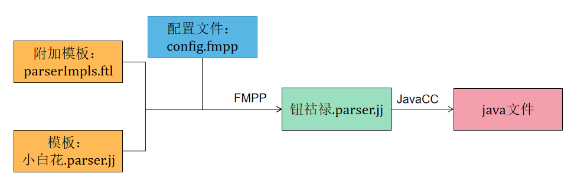

### 词法语法拓展
#### 1. 简述

Calcite的词法语法解析基于JavaCC实现。将描述SQL的词法和语法文件Parser.jj编译成Java文件  

**parserImpls.ftl**
附加模板，添加自定义的SQL语法规则  
路径：src/main/codegen/includes/parserImpls.ftl  

**config.fmpp**  
配置文件，指定需要包含哪些附加模板，添加哪些包，哪些解析方法等等  
路径：src/main/codegen/config.fmpp  

**Parser.jj**(freemarker 模板文件)  
描述SQL的词法和语法文件  
路径：src/main/codegen/templates/Parser.jj  

#### 2. 扩展
Calcite使用FreeMarker和FMPP支持其词法语法扩展，只需要在相应的文件中更改或添加新的SQL语法，FMPP就可为我们生成新的parser.jj文件，而无需在扩展时复制整个parser.jj再进行修改  
利用FreeMarker添加新的语法规则，即添加附加模板: 例如 parserImpls.ftl 。  
config.fmpp中定义了小白花.parser.jj中可变的数据内容，指定需要包含哪些附加模板，导入哪些包等等  
最终生成的钮祜禄.parser.jj文件中包含了附加模板parserImples.ftl的内容以及config.fmpp中定义的数据内容  

#### 3. 定义类
新的SQL语法规则匹配后，需要自定义或修改相应的类去承接解析出来的信息，最终形成一颗语法树  

#### 4. 参考资料  
https://javacc.github.io/javacc/  
https://fmpp.sourceforge.net/manual.html  
https://freemarker.apache.org/docs/index.html  
https://zhuanlan.zhihu.com/p/509681717  

