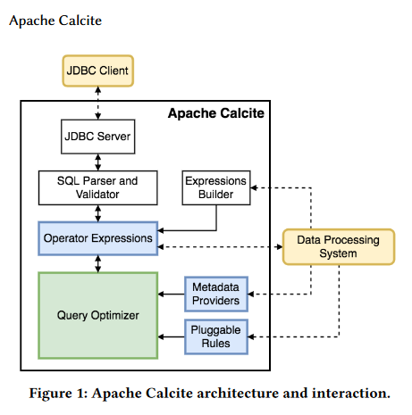

# calcite介绍

## 概览
  
动态数据处理框架，负责parser-->validator-->logicalplan-->optimize-->execute,不负责数据存储  
**calcite使用流程实例代码 CalciteTest**

**docs包含以下几个部分：**  
* 一 [自定义schema和table](./docs/schema.md)  
* 二 [词法语法扩展(看需求)](/docs/LexExtends.md)  
* 三 [语法解析](docs/parser.md)  
* 四 验证  
* 五 生成逻辑执行计划  
* 六 优化查询  
* 七 执行器
* 八 [访问者模式的使用](./docs/visitor.md) 
* 九 逻辑计划转为方言
