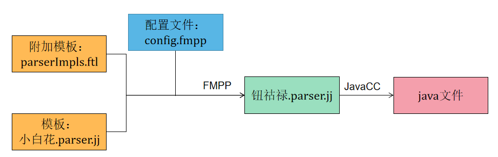

# calcite-example

# 整体流程


parser-->validator-->logicalplan-->optimize  
calcite使用流程实例见 CalciteTest 

**主要包含以下几个部分：**
一 自定义siema和table
二 词法语法扩展(看需求)
三 语法解析
四 验证
五 生成逻辑执行计划
六 优化查询

### 一 schema 和table
catalog中包含了schema，用于提供元数据信息，供验证和生成逻辑计划使用

| 结构       | 描述                                                                    |     |
| ---------- | ----------------------------------------------------------------------- | --- |
| catalog    | 定义了元数据信息和namespace                                             |     |
| schema     | 同sql中的数据库,一个schema可以包括多个子schema                                     |     |
| table      | 同sql中的table                                                          |     |
| adapters   | 整合不同数据源以实现通用访问<br>由model，schema和schema factory组成 |     |


### 二 词法语法拓展
#### 1. 简述
  
Calcite的词法语法解析基于JavaCC实现。将描述SQL的词法和语法文件Parser.jj编译成Java文件  

**parserImpls.ftl**
附加模板，添加自定义的SQL语法规则  
路径：src/main/codegen/includes/parserImpls.ftl  

**config.fmpp**  
配置文件，指定需要包含哪些附加模板，添加哪些包，哪些解析方法等等  
路径：src/main/codegen/config.fmpp  

**Parser.jj**(freemarker 模板文件)  
描述SQL的词法和语法文件  
路径：src/main/codegen/templates/Parser.jj  

#### 2. 扩展
Calcite使用FreeMarker和FMPP支持其词法语法扩展，只需要在相应的文件中更改或添加新的SQL语法，FMPP就可为我们生成新的parser.jj文件，而无需在扩展时复制整个parser.jj再进行修改  
利用FreeMarker添加新的语法规则，即添加附加模板: 例如 parserImpls.ftl 。  
config.fmpp中定义了小白花.parser.jj中可变的数据内容，指定需要包含哪些附加模板，导入哪些包等等  
最终生成的钮祜禄.parser.jj文件中包含了附加模板parserImples.ftl的内容以及config.fmpp中定义的数据内容  

#### 3. 定义类
新的SQL语法规则匹配后，需要自定义或修改相应的类去承接解析出来的信息，最终形成一颗语法树  

#### 4. 参考资料  
https://javacc.github.io/javacc/  
https://fmpp.sourceforge.net/manual.html  
https://freemarker.apache.org/docs/index.html  
https://zhuanlan.zhihu.com/p/509681717 


### 三 语法解析
#### 语法解析代码
语法解析的主要代码在：src\main\java\org\apache\calcite\sql\parser\SqlParser.java  
通过以下代码调用：  

SqlParser 类的实例化函数  
```Java
public SqlParser create(String s)
public SqlParser create(String sql, Config config)
public SqlParser create(Reader reader, Config config)
```
以上函数最终调用SqlParser的构造函数进行类的实例化  

SQLParser 类中的词法语法解析函数  
```Java
public SqlNode parseQuery()
public SqlNode parseQuery(String sql)
public SqlNode parseStmt()
public SqlNode parseStmtList()
```
示例：  
```Java
sql = "select * from testA";
parseConfig = parseConfig = SqlParser.config()
                              .withParserFactory(MPCSqlParserImpl.FACTORY)
                              .withLex(Lex.MYSQL)
			      .withCaseSensitive(false);
SqlParser sp = SqlParser.create(sql,parseConfig);
sp.parseQuery();
```

#### 语法树中的节点和操作
SqlNode节点  

SQLNode 所有解析树节点的父类  
* SqlLiteral   
	常量  
	* SqlNumberLiteral 数字  
	* SqlAbstractDateTimeLiteral  
		* SqlTimeLiteral  时:秒:分(00:00:00[.fraction])   
		* SqlDateLiteral  年-月-日  
		* SqlTimestampLiteral 年-月-日 时:秒 GMT  
	 * SqlAbstractStringLiteral  
		 * SqlBinaryOperatorLiteral 二进制字符串  
		 * SqlCharStringLiteral 字符串  
* SqlIdentifier   
	标识符 表名，列名等等  
* SqlNodeList  
     SqlNode 列表  
* SqlCall  
     非叶子节点的抽象类  
     * SqlSelect   select语句  
     * SqlJoin   join语句  
     * SqlBasicCall  保存操作数operandList和操作算子operator  
     * SqlOrderBy 排序  
     * SqlDdl  
	 * SqlCreate  
		 * SqlCreateTable   建表  
	 * SqlDrop  
SqlOperator节点  

SqlOperator 所有操作符的父类  
* SqlSpecialOperator  
	特殊语法的通用运算符  
	* SqlAsOperator  
* SqlBinaryOperator   
	两个操作数的运算符  
	EQUALS, NOT_EQUALS, IS_DISTINCT_FROM, IS_NOT_DISTINCT_FROM, OR, AND, PLUS, TIMES,GREAT_THAN, CREATER_THAN_OR_EQUAL, LESS_THAN, LESS_THAN_OR_EQUAL
	* SqlSetOperator (UNION, INTERSECT, MINUS)  
* SqlUnresolvedFunction  
	解析生成，通过validator转为正确的function  


 
