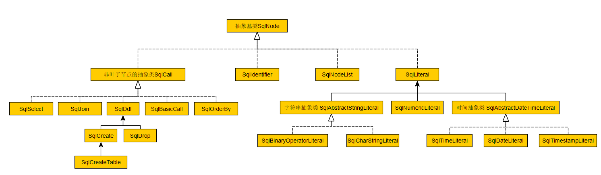
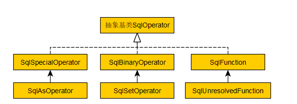

### 四 语法解析
#### 1. 语法解析代码
语法解析的主要代码在：src\main\java\org\apache\calcite\sql\parser\SqlParser.java  
通过以下代码调用：  

##### 1)SqlParser 类的实例化函数  
```Java
public SqlParser create(String s)
public SqlParser create(String sql, Config config)
public SqlParser create(Reader reader, Config config)
```
以上函数最终调用SqlParser的构造函数进行类的实例化  

##### 2)SQLParser 类中的词法语法解析函数  
```Java
public SqlNode parseQuery()
public SqlNode parseQuery(String sql)
public SqlNode parseStmt()
public SqlNode parseStmtList()
```
以上函数进行词法语法解析，最终生成一颗语法树

##### 3)示例：  
```Java
sql = "select * from testA";
parseConfig = parseConfig = SqlParser.config()
                              .withParserFactory(SqlParserImpl.FACTORY)
                              .withLex(Lex.MYSQL)
			      .withCaseSensitive(false);
SqlParser sp = SqlParser.create(sql,parseConfig);
sp.parseQuery();
```

#### 2. 语法树中的节点和操作
##### 1)SQLNode 所有解析树节点的父类  
  
* SqlLiteral   
	常量  
	* SqlNumberLiteral 数字  
	* SqlAbstractDateTimeLiteral  
		* SqlTimeLiteral  时:秒:分(00:00:00[.fraction])   
		* SqlDateLiteral  年-月-日  
		* SqlTimestampLiteral 年-月-日 时:秒 GMT  
	 * SqlAbstractStringLiteral  
		 * SqlBinaryOperatorLiteral 二进制字符串  
		 * SqlCharStringLiteral 字符串  
* SqlIdentifier   
	标识符 表名，列名等等  
* SqlNodeList  
     SqlNode 列表  
* SqlCall  
     非叶子节点的抽象类  
     * SqlSelect   select语句  
     * SqlJoin   join语句  
     * SqlBasicCall  保存操作数operandList和操作算子operator  
     * SqlOrderBy 排序  
     * SqlDdl  
	 * SqlCreate  
		 * SqlCreateTable   建表  
	 * SqlDrop  
##### 2)SqlOperator 所有操作符的父类  
  
* SqlSpecialOperator  
	特殊语法的通用运算符  
	* SqlAsOperator  
* SqlBinaryOperator   
	两个操作数的运算符  
	EQUALS, NOT_EQUALS, IS_DISTINCT_FROM, IS_NOT_DISTINCT_FROM, OR, AND, PLUS, TIMES,GREAT_THAN, CREATER_THAN_OR_EQUAL, LESS_THAN, LESS_THAN_OR_EQUAL
	* SqlSetOperator (UNION, INTERSECT, MINUS)  
* SqlUnresolvedFunction  
	解析生成，通过validator转为正确的function  
