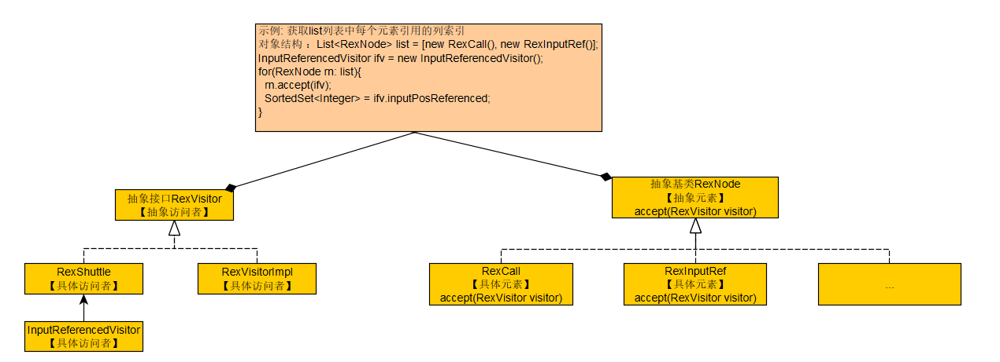

### 八 访问者模式的使用
#### 1)介绍
* 访问者模式将数据操作与数据对象分离，在不修改已有程序结构的前提下，通过增加额外的访问者实现功能。  

> 节选自 https://www.zhihu.com/question/37236639  
>***Q: 设计模式模式看多了，总是觉得有点理不清。
>Vistor 设计模式使用的多吗？从字面翻译总会和Observer设计模式有混淆。请给位给个形象的介绍下***
>
>A: 刚好最近跟新同事讲解了一下，整理一下思路记录在这里吧。
>
>目前网上大部分介绍访问者模式的文章，往往谈到把集合元素中的逻辑抽取到一个访问者实现上就算了。这导致两个问题：
>
>1. 不少人看完后还是不理解为何要把本来在元素内部实现的，关于元素自身行为的逻辑抽取到访问者上；
>
>2. 过于看重利用方法重载的那一次回调，认为利用重载（在访问者接口上使用同一名称但不同参数的多个方法）是访问者模式的关键。有的文章甚至认为，所谓的双分派，其中一次分派就是发生在这里的重载调用上。
>
>我们知道，设计模式并不是四人帮自创的招式，而是他们对业界中常用设计手段的总结。那么要理解访问者模式，我们不妨先抛开设计模式里的描述，看看原本的设计场景。
>
>首先我们来复习一下“基于类型的动态单分派”这个概念（已经了解的朋友可以跳过），这是什么意思呢，说白了就是面向对象的多态特性。
>
>比如说，现在在做一个类似于红色警戒这样的战争游戏。我有一个基类或者接口叫“士兵”，这个基类下有“枪兵”，“火兵”，“手榴弹兵”等等子类。显然每种士兵的攻击方式都不一样，但在面向对象编程中，我可以在“士兵”基类上定义一个“进攻”方法，每个子类提供其具体实现。在打仗时，我只要拿着一个“士兵”的集合，让一个传令兵无脑向每一个士兵传令“进攻”，然后他们就各司其职了。在编程实践中，就是用循环挨个通知集合里的“士兵”元素“进攻”。
>
>这种开发方式事实上没有减少代码量，最关键的好处，是分离开了“训练官”（实现编写者）和“战场指挥官”（客户代码）两个角色。理解角色的分离是理解大部分设计模式的关键，特别在访问者模式中，原书的描述就提到了“独立演进”，这里所谓的“演进”，就是不同角色在各自的职责和意识范围内，自由对代码进行扩展。回到例子，训练官意识不到真实战场上的时机，他只管训练不同种类的士兵，在他的职责范围内，可以继续扩展出“狙击兵”，“高速突击兵”等等多个兵种。而战场指挥官，可以只关注战场的即时动态，决策何时进攻，而这时他不需要关注不同兵种的具体攻击手段，只需要知道手下有“士兵”，他们能“进攻”就行了。
>
>说点题外话，在这个过程中，还有很多隐含角色，比如说负责决定这些不同兵种的士兵是如何分配给每个战场指挥官的招兵员，这个角色也可以叫“对象工厂”（创建模式）。比如说你可能会发现，“战场指挥官”本身也是“士兵”，他的“进攻”手段就是指挥下面的底层士兵进攻，显然“战场指挥官”也可以有上级，他的上级也可以是具有“进攻”行为的“士兵”。据此就能形成层次关系，在这种层次关系的中的传令兵也可以是一个独立角色（组合模式）。这些不同的角色，都可以独立演进。
>
>言归正传，为了保证这种“独立演进”能力，在“战场指挥官”（客户代码）的角度，显然是不应该去关心具体有哪几种士兵的，否则就破坏了训练官的“独立演进”，因为这时如果训练官训练出来一个指挥官不认识的新兵种，指挥官就不知道如何去指挥了。反映在实践中，就是不应该用instanceof或向下转型来针对具体兵种编程。这里先请把“尽量避免使用instanceof或向下转型”这条原则记住，后面会用到。
>
>在这里，“基于类型的动态单分派”发生在“士兵”这个基类接受到“进攻”这个信息时，可以动态地根据实际类型，执行子类上的“进攻”方法的实现逻辑。更多关于“基于类型的动态单分派”说明请移步这个答案：知乎用户：JAVA的多态用几句话能直观的解释一下吗？
>
>以上就是经典的普通“多态”场景。
>
>好，现在考虑一种进阶场景，队伍里除了打仗的士兵，还有治疗的医疗兵，而且医疗兵是另一个训练官教出来的（也就是现在“训练官”的角色分离成了“士兵训练官”和“医疗兵训练官”这两种不同角色），而“医疗训练官”坚持使用“治疗”这个命令来训练医疗兵。那么，为了战时指挥官能顺理指挥，可以有几种方法（战场指挥官跟训练官可以自由调整事先约定的规则）：
>
>1. 训练官额外培训一种更为抽象的命令方式，比如说“行动”。士兵的“行动”事实上就是“进攻”，医疗兵的“行动”事实上就是“治疗”。这种做法的缺点是，这种命令往往过于抽象，本来使用“攻击”和“治疗”这样的命令，旁观者（读程序和维护程序的人）可以清楚看出意图，而“行动”，却丢失了这种信息。更重要的是，如果这个“行动”还需要带上额外的参数，比如说，士兵的“进攻”可以加一个参数表示前进多少米，医疗兵的“治疗”可以加一个参数表示救多少个人。那么在通过统一的“行动”命令传入参数时，参数就必须被包装为统一的类型，这种参数类型在语义上自然也会被迫设定得很虚，比如说Event或Options之类。传入后再在实现代码里向下转型，失去了面向接口编程的“协约”功能。
>
>2. “传令兵”根据接受命令的对象的实际兵种，分别发出“进攻”或“治疗”指令（也就是说，使用instanceof和向下转型）。这里的问题是，本来只需要训练官和指挥官之间做约定，现在把传令兵也拖下水了。传令兵不但要关注组织结构，还需要关注元素的具体类型，本来的两方约定现在变成三方约定。而且在编程实践中，如果不对“传令兵”代码作进一步分离，很容易出现“指挥官”发出的复杂命令与“传令”逻辑纠缠在一起的情况，失去了“传令兵”和“指挥官”两者的独立演化能力。
>
>为了解决这个问题，现在可以引入一种访问者模式的简化版。我们把整套机制改成这样：
>
>1. 指挥官改为通过录音来发号司令。他跟训练官约定，给士兵的命令，录在标题为“给士兵的指示”的录音带上，给医疗兵的命令，录在“给医疗兵的指示”录音带上。
>
>2. 后勤部提供一种包含“给士兵的指示”和“给医疗兵的指示”的双联录音带套装，避免指挥官遗漏特定兵种。
>
>3. 传令兵继续无脑送信。
>
>4. 训练官统一教给队员“接受录音上的指令”（accept）这种行动。在这种行动中，士兵的具体动作是“按照‘给士兵的指示’上面的命令行动”，医疗兵的具体动作是“按照‘给医疗兵的指示’命令行动”。（这里假定接受者无法区分命令是由真人发出的还是由录音发出的）
>
>这套机制还可以做一些改动，比如说，去掉“传令兵”这个角色，改为击鼓传花形式，在指示中包含“如果某个条件成立，就把信件传给下一个人”这样的指令，来进行支持更为复杂的传令逻辑。
>
>这套机制的好处是，既保证了指挥官下达的指令不至于过于抽象而失去现实语义，又避免了在实战时对兵种进行类型判断，保证了指挥官，传令兵，训练官三者的独立演化。缺点是，如果再加入一种具有特殊动作的新兵种，指挥官，后勤部，训练官全都要作出改变。因而这种方案只适合于接受不同命令的顶层兵种基本确定情况（当然接受相同命令但具体行为不同的子兵种仍然可以基于多态自由扩展）。
>
>这种机制其实就是访问者模式的一种简化情况。正如前面说的，网上不少资料对访问者模式的介绍到这个层面就结束了。有一些文章认为，这里发生了两次分派，第一次是在“接受录音指令”命令中，不同类型的接受者根据自身类型选择不同的录音带。第二次是对录音带上的命令跟着自身类型作出不同的具体行动（前面单分派例子中就有的那一次）。而且在第一步中，可以利用重载这个语言特性来在字面上统一回调接口。比如说，后勤部模板中 “给士兵的指示” 改为 “指示（士兵）”，“给资料兵的指示”改为“指示（治疗兵）”，接受者在接受命令时，只需要执行“给我指示”，就有某种机制播放相应的指令（而不需要显式写instanceof）。
>
>然而在编程实践中，这里的第一次分派逻辑基本上是在设计这套机制时就写死的，训练官本来就应该知道他教出来的兵应该去看什么类型的指示，从独立演化能力来看，模板上到底是“给士兵的指示”或是“指示（士兵）”，以及每个兵在“接受录音指令”时，必然是“按照录音行动”这个动作，具体到底写成“按给士兵的指令行动”还是“给我指示”，并没有影响概念的分离，根本无伤大雅。在实践中，这里的代码一般是写在每个兵种的基类里，不会有任何变化，也不可能涉及任何具体业务逻辑，属于抽象机制的一部分，在开发期（而非运行期）其执行逻辑已经完全确定。在设计模式一书里，也指出采用同名方法重载或采用不同的方法名两种方式均可。
>
>因此说这个例子是访问者模式的简化版，它包含了一次静态的分派（各个兵种写死了看什么类型的指示）和一次动态分派（前面提到的多态分派）。实现了支持对集合容器里持有不同接口行为的元素进行统一调用。
>
>现在我们再来看一个完全版例子。现在总部觉得这套机制还是太简单了，现场指挥官只能决定何时行动，难以顾及到不同地形环境下的不同作战方式。比如说，假如士兵有“隐蔽”，“突进”和“攻击”三个动作。在平地，应该先“突进”后“攻击”，而在山地，应该先“隐蔽”后“攻击”，等等。所以，现在引入一个新的角色，战术研究所。这个研究所的工作就是使用后勤部给出的录音带模板，制作不同的战术录音带套装，比如说“平地指令套装”，“山地指令套装”。现在现场指挥官可以只专注于决定何时进攻，然后根据实际环境，拿出相应的录音带套装交给传令兵。
>
>这里才是真正的第二次动态分派，训练官在训练时使用的是后勤部的模板，士兵在接受到录音带时在他的概念中这就是训练时的录音带模板，但事实上根据指挥官选取不同的录音带套装，他会听到不同的指示。对应到具体编程，就是针对Visitor接口本身进行扩展。两次动态分派，一次发生在由Visitor接口分派到具体Visitor子类，另一次发生在由元素接口分派到具体元素子类。
>
>在实际应用中，常见的有两种情况：
>
>一种是框架设计者充当后勤部（提供多个可选元素接口和Visitor接口），传令兵（提供访问逻辑，例如循环，传递，深优，广优等），战时指挥官（决定何时开始访问)，战术研究所（提供不同的Visitor子类，决定指令内容），框架使用者充当训练官和招兵员（对象工厂），提供元素集合，与普通单分派相比的好处是元素可以在多个可选接口中选择一来实现。
>
>另一种是框架设计者充当后勤部，训练官，招兵员和传令官，给出基本的元素类型和访问逻辑，框架使用者充当战时指挥官和战术研究所，决定何时访问和执行内容。更灵活的设计同时也允许框架使用者扮演训练官，提供元素子类型，通过替换对象工厂来把新子类放进集合里。
>
>当然事实上框架设计者和框架使用者的角色可以根据需要任意组合，不过通常框架设计者会包揽后勤部（提供接口）和传令兵（提供访问逻辑）这两个角色。
>
>最后再强调一次，访问者模式的缺点是添加新的顶层元素类型会非常麻烦（几乎所有角色都需要相应改动），它的作用就是牺牲添加顶层元素的灵活性，来换取其余各个角色的独立演化能力。

* 角色介绍 
  * 抽象元素  定义一个接口或抽象类，表示元素对象的通用行为（士兵）
  * 具体元素  实现抽象元素接口，定义自己特定的行为 （步兵，枪兵，医疗兵）  
  * 抽象访问者  定义一个访问者接口或抽象类，申明访问具体元素的方法 （作战套装）   
  * 具体访问者  实现抽象访问者接口，定义对每个具体元素的访问 （平地作战套装，山地作战套装）   
  * 对象结构  定义了一个容纳元素对象的容器,可以是列表，集合等

  

#### 2)calcite中visitor模式
Calcite对抽象语法树SqlNode，关系表达式relNode，行表达式rexNode都实现了visitor模式。  
以rexNode为例：
  

* 抽象元素  
  * RexNode 
* 具体元素
  * RexCall
  * RexInputRef
* 抽象访问者  
  * RexVisitor 
* 具体访问者  
  * RexVisitorImpl  
  * RexShuttle  
    * InputReferencedVisitor  
* 对象结构  
  * List<RexNode> list  

